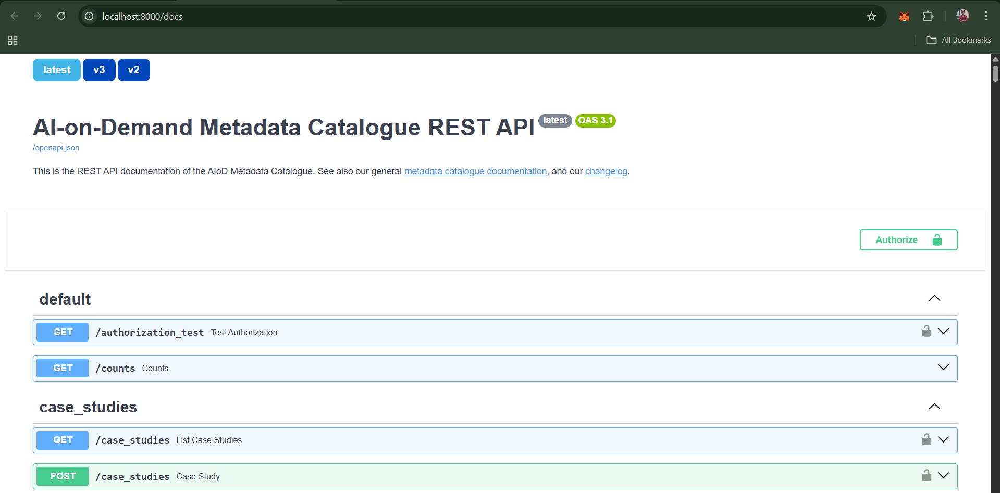
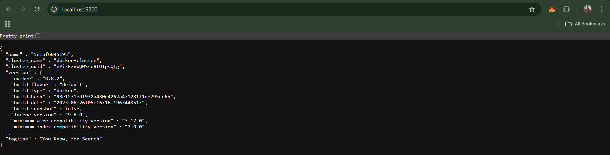

# AI-on-Demand dev environment setup guide

This guide sets up a complete local development environment for AI-on-Demand, which consists of:

**What you'll set up:**
1. Python client library (`aiondemand`)
2. REST API backend service (`AIOD-rest-api`)
3. Development tools (linting, testing, pre-commit hooks)

Both repositories work together as a single system and should be tested together.

---

## Prerequisites

- Python 3.10 or higher (check with command: `python -V`)
- pip package manager (check with command: `pip list`)
- Docker setup (check with command: `docker ps`)

---

## One-Time Initial Setup

### Part 1: Setup `aiondemand` (Python Client)

Clone the repository:
```bash
git clone https://github.com/aiondemand/aiondemand
cd aiondemand
```

**Create and activate virtual environment:**

```bash
# Create venv
python -m venv venv
```

**Windows:**
```bash
.\venv\Scripts\activate
```

**Mac/Linux:**
```bash
source venv/bin/activate
```

**Install Package with developer dependencies**

```bash
pip install -e ".[dev]"
```

**Quick check**:
```bash
python -c "import aiod; print('aiondemand installed successfully!')"
```

---

### Part 2: Setup `AIOD-rest-api` (Backend Service)

Clone the repository:
```bash
git clone https://github.com/aiondemand/AIOD-rest-api
cd AIOD-rest-api
```

**Configure environment:**

Edit the `.env` file to enable local development mode (located at line no.: 4):
```bash
USE_LOCAL_DEV=true
```

**Build Docker images** (one-time):
```bash
# Build specific images
docker compose build app
docker compose build deletion

# Build all images
docker compose build

# Run DB data migration
docker compose up fill-db-with-examples
```

- **Note:** Add this command in the `Dockerfile` after the `apt-get install` block if the python package dependencies seem to be broken (happens sometimes in Windows): `pip install --upgrade pip setuptools wheel`

**Running tests**
```bash
py -3.11 -m venv .venv
.venv\Scripts\activate
pip install -e ".[dev]"
pytest src/tests
```
Note: currently the tests are expected to fail. update regarding this is currently tracked here: https://github.com/aiondemand/AIOD-rest-api/issues/681

---

## Complete System Verification

After completing both setup parts, verify the entire system is working:

### 1. Verify Python Client Installation
```bash
cd aiondemand
.\venv\Scripts\activate  # Windows
# source venv/bin/activate  # Mac/Linux

python -c "import aiod; print(f'aiod version: {aiod.__version__}')"
```

### 2. Verify REST API Service
Start the services:
```bash
cd AIOD-rest-api
docker compose up
```

Check API documentation at: `http://localhost:8000/docs`



### 3. Verify data migration in database
As the mysql database does not expose any ports, we cannot check the data in tables directly using a db client. instead we can manually check from the openapi docs or run `curl` request on the actual fastpi endpoint to check if there is any data in the table:

```bash
curl "http://localhost:8000/counts/contacts?detailed=false"
```
- Should return 1

### 4. Verify Elasticsearch
Go to `http://localhost:9200` and login with:
- **Username:** `elastic`
- **Password:** `changeme`



---

## Common Development Tasks

### Using the SDK with a Local Backend


By default, the SDK (`aiod`) connects to the remote production backend at `https://api.aiod.eu/`. To use your locally running backend (for development or testing), update the API server URL in your code as follows:

### 1. Configure SDK to Use Local Backend

Set the API server URL before making any requests:

```python
import aiod

# Point the SDK to your locally running backend
aiod.config.api_server = "http://localhost:8000/"
```

### 2. Fetch Data from Local Backend

Now you can use the SDK as usual, and it will communicate with your local backend. For example, to fetch a list of contacts (assuming your local database has data):

```python
import aiod

# Ensure the SDK is using the local backend
aiod.config.api_server = "http://localhost:8000/"

# Fetch and print the list of contacts
contacts = aiod.contacts.get_list()
print(contacts)
```

To confirm your local server is set up perfectly, it should return a response like this:

```bash
  platform platform_resource_identifier  ...         telephone                    identifier
0  example                            1  ...  [0032 xxxx xxxx]  con_osweUoxaTYQDVuoEwz9HdWXx

[1 rows x 7 columns]
```

This will retrieve data from your locally running backend instead of the remote server. You can set `aiod.config.api_server` to any remote or local URL as needed.

### Starting the Development Environment

**Every time you work on the project:**

1. **Activate Python environment:**
   ```bash
   cd aiondemand
   .\venv\Scripts\activate  # Windows
   # source venv/bin/activate  # Mac/Linux
   ```

2. **Start backend services:**
   ```bash
   cd AIOD-rest-api
   docker compose up
   ```

3. **Stop services when done:**
```bash
# In the AIOD-rest-api terminal, press Ctrl+C, then:
docker compose down
```

---

## Contributor Workflow Guide

Before raising a pull request, run these checks to ensure code quality:

### Run Full Test Suite
```bash
cd aiondemand
.\venv\Scripts\activate  # Windows
# source venv/bin/activate  # Mac/Linux

python -m pytest -v
``` 

### Run Linting
```bash
ruff check .
```

### Auto-fix Linting Issues
```bash
ruff check --fix .
```

### Run Pre-commit Hooks
```bash
pre-commit run --all-files
```
